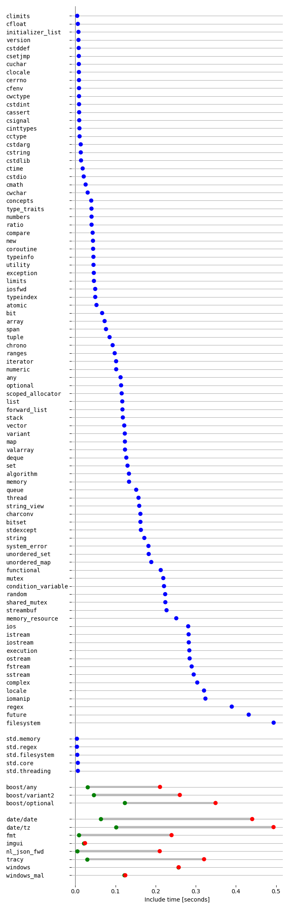
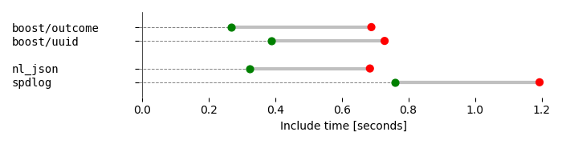

# C++ library include times (CPP-LIT :fire:)
This repo answers the question: how much time is added to my compile time by a single inclusion of header X? Featuring *all* C++ Standard Library headers, their C++20 [module versions](https://docs.microsoft.com/en-us/cpp/cpp/modules-cpp?view=vs-2019) as comparison, some boost headers, `windows.h` and much more. Visual Studio (the latest as of writing: 16.8.0 Preview 2) is used as a platform.

`windows_mal` refers to the common
```
#define WIN32_LEAN_AND_MEAN
#include <windows.h>
```

Note that I've split the more expensive includes in a separate image with a differen x-range to not crush the important standard headers.

- Boost was measured in v1.74.0
- `date/date` and `date/tz` refer to [HowardHinnant/date](https://github.com/HowardHinnant/date).
- [tracy](https://github.com/wolfpld/tracy) v0.7.1, obviously with the `TRACY_ENABLE` define.
- [spdlog](https://github.com/gabime/spdlog) v1.8.0 using header-only version with only `spdlog.h` included. Readme recommends to use the static lib version instead for faster compile times.
- [fmt](https://github.com/fmtlib/fmt) v7.0.3 including only `fmt/core.h`.
- [Dear ImGui](https://github.com/ocornut/imgui) v1.78.
- [JSON for Modern C++](https://github.com/nlohmann/json) v3.9.1. Note that this is split into the main header (nl_json - `json.hpp`) and the forward include header (nl_json_fwd - `json_fwd.hpp`). The latter is what you would include often.

The compile time of several 3rd party headers is dominated by standard headers. In practice the compile time might be much lower if the translation unit already includes some of those. Therefore all non-standard headers now have a second green datapoint that compares has all standard headers included before them. Many have dramatically lower include times. Both points are extremes - the real impact depends on the standard headers you already include and is somewhere between those two.

Note that for imgui and windows headers, both times are identical and the points barely visibly as a result.

Note that these C++20 headers aren't shipped yet but will be added as soon as they do: `barrier`, `format`, `latch`, `semaphore`, `source_location`, `stop_token`, `syncstream`.




All reported times are based on release builds. The measurements are done on a basically empty single file project that includes one of the headers above at a time and is compiled with `CL.exe`. The baseline (or "null") measurement contains no includes. The plotted times are the difference between those two. All times averaged over many repetitions to avoid outliers. Standard deviations are computed but are small enough to be omited. Note that the absolute times obviously depend on the used hardware.

If you want to run the measurements yourself:
```
.\run_numbers.ps1 # this takes about 5 minutes on my machine, adjust paths
.\parse_numbers.ps1
```
And plot however you like. The plotting script I used is under `plotting`.
